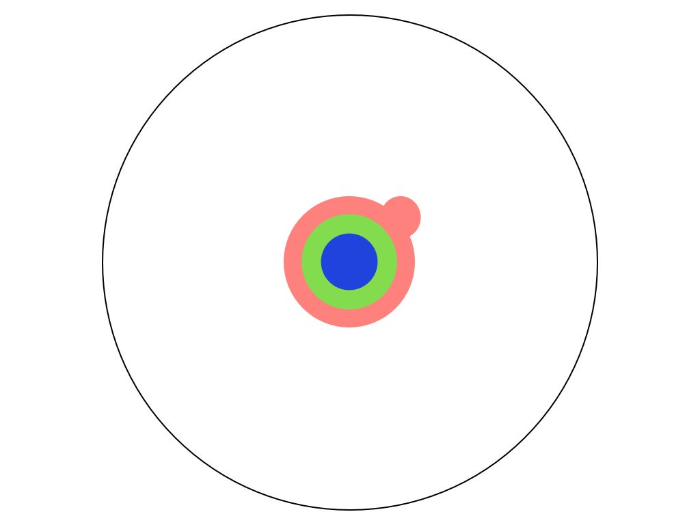

# 工程師年齡歧視的真象

大齡工程師面對的技術挑戰，是我最近碰上的一堵高牆，真的等撞上後才知道，並不是那麼容易跨過，且願意去跨過的。

以我為例，我的工程師生涯是隨著 Java 生態系一起成長的，十五年來 Java 生態系的東西我大多有碰過，十年來同時還用了 Scala 生態系的一些東西。但是去年換到一間五歲左右的軟體公司，公司用的技術是 Scala, GRPC, Akka, Slick, Sangria, Json4s, Consul, Envoy, Python, Airflow 等，我就有點適應不良了。

原因是，我本來就有一整套運作良好的軟體架構跟函式庫在我腦袋裡面，這些函式庫經過 Java 生態系十多年來的驗證，大大小小的功能都有支援了，然後 Bug 也在十多年來被清除乾淨，有許多的最佳實例（best practice）可以參考，不用重新摸索，可以很快的變即戰力。

像是 Json4s 完完全全比不上 Jackson-Json 這套函式庫，但是因為這是 Scala 原生的函式庫，所以得到我們團隊的採用。其他更不用說 IoC 的架構，有 Spring 或 Guice 的架框輔著，可以更有效率的使用，但是我的前團隊寧願重新造輪子，用 cake pattern 加上 IoC 的觀念，來把軟體元件串接起來。

我在這個新團隊中，被迫要把熟悉的架構，一個個都抽換掉，重新再摸索一個不同的函式庫，看他怎用不同的手法解決同一個問題。對我來說，既使一個新的函式庫有比舊的函式庫好上 10% 好了，對我個人的總生產力只有增加 1% ，若是扣掉學習的時間，算上機會成本，對我反而是沒有幫助的，同樣的時間，我可以花在學習新的領域上面，擴展我的知識範圍。

在這段時間，我體會到「技術是熟的好」，不管是什麼技術，用上手就好，反正到最後分高下的，大多是對工具的熟悉程度最重要。**大多數人是把二十多歲前接觸的世界當常態，然後用一輩子在這個時間凍結的世界內，最佳化自己的生活方式。**

# 知識探索的過程

[Matt Might](http://matt.might.net/)用了[幾個簡而易瞭的圖片](http://matt.might.net/articles/phd-school-in-pictures/)清楚的形容了博士的工作到底是在做什麼。

 * 把人類的所有知識想像是一個大圓
 * 當你小學必業後，你有一些理解
 * 高中之後，你又多學了一些
 * 到了大學，你開始學習專業領域
 * 到了碩士，你又多精深了一些
 * 到了博士班，開始讀論文後，開始達到某個領域的最前線
 * 放大
 * 經過幾年的努力，一直推進
 * 總算，某一天，你有個小突破
 * 這個就叫博士學位
 *  但是別太自滿，從巨觀看來是這樣的

# 新程式語言

為什麼過去 20 年來，我們有這麼多的新函式庫新語言興起，然後熱門了幾年後，最後大多數公司還是回歸 Java 生態系，為什麼軟體產業要花這麼多的心力，重造輪子，探索不一樣的可能呢？

因為沒有了這些從新造輪子的知識探索過程，人類的科技不會進步，所以軟體業在可見的將來，都會一直發明新的語言，用不同的實作方式，來解決同一樣的問題。

在過去的二十年間，有許多的語言興起，如 PHP、Java、C#、Python、Ruby、Java Script / Node.JS、Typescript、Coffee Script、Groovy、Kotlin、Clojure、Go及 Rust 等語言，各有優劣，有些變成主流語言，有些在風頭過了之後，就漸漸平淡下去。

如果你是軟體行業的新人，你是否該追求新技術，還是要學習穩定好用的技術呢？這影響到了你未來的職場生涯。

像是矽谷的大公司，一定是選用最新最熱門的技術，因為最新最熱門的技術，才能吸引到源源不決的新鮮人加入公司，新鮮人才是公司的未來，需要這些勞動力來推動公司的業務。如果一間公司選用了非熱門技術，那麼使用者的總量少，挑選到一流人材的機會更就少了，而且這有可能變成公司成長的限制，無法找到足夠的人材來推動公司的新業務。

而對於新鮮人來說，選用新興的語言技術，有除了市場需求以外的好處；羅馬不是一天造成，軟體的複雜度也不是一天造成的；我常聽到有人報怨 Spring 太過於複雜，但是對我來說 Spring IoC 是很精巧的，只是因為大環境的改變， Spring IoC 從一開始的使用 XML 來設定，演化到使用自己的 Annotation 來設定，最後是到 Java 標準化的 JSR-330 來使用，對於新進用戶，只需要學習其中的一種就好。

我能夠理解這些，是因為我跟著這個框架一起成長的，理解它在過去因為什麼理由而做出變更，跟什麼歷史遺留做出妥協，為什麼一個功能會設計成這樣。也因此我建議新鮮人，要學習市場上新興熱門的技術。你可以從頭，當一個框架很精巧時，把它的程式碼讀完，當它每一次新增一個功能時，想想，如果是你會怎麼做，為什麼官方會做出這些取捨。

# 技術是熟的好

但是在追求新技術外，你也要考量到，現在多數的新技術，是設計給大公司用的，除非你要一直幫超大型網路公司上班，你學習的技術往往是過度複雜，甚至是不合用的。

例如現在許多的開源專案，使用 Protocol Buffers & GRPC 來做序列化（Serialization），把記憶體中的狀態寫到磁碟上或透過網路傳送到遠方，但是 PB  的許多設計是為了減少通訊時使用的空間的，像是 PB 會省略掉欄位的名稱，用 index 來取代，在內容上也會用一些方法壓縮空間。這些做法對谷歌來說都是合理的，因為谷哥的資料量太大，如果可以省下百分之一的空間，那麼就可以幫公司省下數千萬數億美金的網路傳輸費用及儲存費用，但是大多數公司不是谷歌不是臉書，你的公司的網路流量連谷歌的萬分之一都不到，不需要去做這些最佳化，而且有修改是無法向前相容的，是要靠人腦去做的調整的，例如把一個欄位從 int 改成 long ，等你的資料有 1TB 時，再來考慮最佳化吧，程式設計師的工資是很貴的。

我是建議大多數人用 json 來做 RPC protocol ，用 json 來做資料庫內的 blob ，用 json 來做 hadoop / big data 的格式， json 最大的好處是好讀，大家可以用人眼就可以讀他的內容，不需要靠其它程式來轉換，而且 json 的支援很廣，不管是什麼大數據框架都支援 json 。我上一份工作，有一部份的時間，因為不同系統吃不同的格式，就花在 json / protobuf / parsec 的資料格式轉換上面。

扯遠了，如果你學習一套運作良好的全棧 full-stack 框架，例如像是 Rails ，花個三年時間把他裡裡外外都摸個透徹，未來要做一個新產品，那麼在技術方面的時程估算，將會較簡單就估算出一個時程表，而且因為你對細節清楚，就更不容易因為細節出包，而影響到專案的時程。

至於對於新鮮人該走那一條路，是要追求新科技，還是摸熟某一套技術，我在下一章會有討論。

